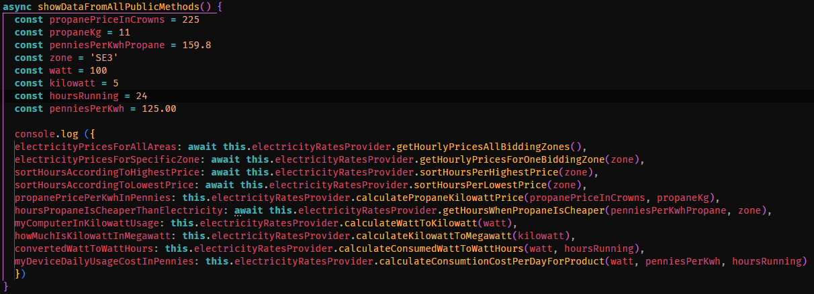

# **Energy Price Module**

The main goal of this module is to extract the day ahead prices for Sweden's bidding zones, SE1 - SE4. The data being recieved comes from Nord Pool's API which runs the leading power market in Europe. The prices are available from **1pm the day before** and as a developer you can choose to receive prices for all zones or a specific zone and to have a certain zone sorted from highest price to lowest, and vice versa. Also included in the module are a bunch of other methods that can further facilitate the calculation of electricity costs. More about them further down.
#### Important! The module does not include the cost of electricity certificates, surcharges, energy tax, VAT and electricity grid costs.

---

## **Motivation**
With today's electricity market in mind, this module was created as a tool for users who want to get tomorrow's hourly electricity prices. Furthermore, the data retrieved can be used to optimize electricity consumption in homes or in an application for visualize tomorrow's hourly price. By gaining an insight into when electricity is most expensive, this can help redirect consumption to hours when the price is lower and thus help lower electricity costs for people in their homes.

---

## **Code Style**
[](http://standardjs.com)

---

## **Dependencies**
```node-fetch```
 A light-weight module that brings Fetch API to node.js

---

## **Installation**
Clone the repository from Github by running the following command in the terminal. The repot will be cloned down where the terminal path points to:
 ```
 git clone https://github.com/TessGrass/laboration-1.git
 ```

Open the cloned repo with any IDE, for example Visual Studio Code.

Use the package manager npm to install the module and it's dependencies. To install, simply type the following command in the terminal:
```bash
npm install
```
---

## **Overview**

```
Laboration 1  
│
└───energy-price-module/
│ │
│ └───src/
│     │───spotPriceApi.js
│     │───index.js
│     │───validateInputHandler.js
│
│───images/
│
└───test-rapport/
│   │
│   └───images/
│   │
│   └─── TestRapport.md
|
│───package.json
│───package-lock.json
│───README.md
│───Reflektion.md
│───Release.md
│───testModule.js
```
---

## **How To Use The Module In Your Project**
* index.js is the main file which contains all the methods you want to use in your project.
* spotPriceApi.js contains private methods that takes care of the API request /response.
* validateInputHandler.js validates all inputs from a user and ensures that the entered value is correct.
* testModule.js is a way for a developer to try out the module and it's public methods right-away!


### **How To Test The Module And It's Methods**

The testModule.js contains all the public methods you as a developer want to use in your project and it runs the methods inside a console.log, as the image shows.
In order to quickly and easily get started with testing the module, each method is independent and gets its arguments ​​from the variables directly in the test module, feel free to elaborate with them yourself! When you are done testing a method you can just comment that one out.
<br>



To run the testModule.js just open the terminal and type:
```
node testModule.js
```
or open package.json and under scripts add:
```
"start": "node testModule.js",
```
and then run the command:
```
npm start
```

## **A Quick Overview Of The Available Methods In index.js**
```javascript
'returns day ahead prices for all bidding zones'
getHourlyPricesAllBiddingZones()

'returns day ahead prices, in pennies, for a specific zone. If no prices are found it returns 0'
getHourlyPricesForOneBiddingZone(zone)

'returns the prices for a specific zone, sorted from highest to lowest'
sortHoursPerHighestPrice(zone)

'returns the prices for a specific zone, sorted from lowest to highest'
sortHoursPerLowestPrice(zone)

'returns the kilowatt price, in pennies, for propane'
calculatePropaneKilowattPrice (propanePrice, propaneKg)

'returns the hours when the propane, per kilowatt, is cheaper than kilowatt'
getHoursWhenPropaneIsCheaper(propanePricePerKwh, selectedZone)

'returns kilowatt'
calculateWattToKilowatt(watt)

'returns megawatt'
calculateKilowattToMegawatt(kilowatt)

'returns watt hours'
calculateConsumedWattToWattHours(watt, hoursRunning)

'returns the daily cost of running a device'
calculateConsumtionCostPerDayForProduct (watt, penniesPerKilowatt, hoursRunning)
```

## Contributing
Feel free to contribute! For major changes, please open an issue first to discuss what you would like to change.

## License
[MIT](https://choosealicense.com/licenses/mit/)