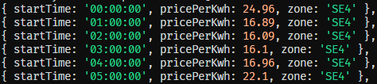

# Testspecifikation
## **BESKRIVNING**
Modulen har testats genom manuella tester vilket redovisas i den här rapporten. Ingra krav finns kopplade till testen. Samtliga tester som genomförts avser modulversion 1.0.0.

## **ÖVERSIKT**

### **Klass ElectricityRatesProvider - index.js**
| Metod | Status |
| ----------- | ----------- |
| getHourlyPricesAllBiddingZones() | ✅ |
| getHourlyPricesForOneBiddingZone() | ✅ |
| #extractStartTimeFromDate() | ✅ |
| sortHoursPerHighestPrice() | ✅ |
| sortHoursPerLowestPrice() | ✅ |
| calculateWattToKilowatt() | ✅ |
| calculateKilowattToMegawatt() | ✅ |
| calculateConsumedWattToWattHours() | ✅ |
| calculateCostPerDayForProduct() | ✅ |
| #removeDecimalsInNumber() | ✅ |

---

### **Klass SpotPriceApi - spotPriceApi.js**
| Metod | Status |
| ----------- | ----------- |
| #getTomorrowsElectricityData() | ✅ |
| #getTomorrowsDate() | ✅ |
| #convertToCorrectDateFormat() | ✅ |
| #getTomorrowsElectricityData() | ✅ |
| #extractElectricityPricesAndZones() | ✅ |
| #convertStringToNumber() | ✅ |
| #removeDecimalsInNumber() | ✅ |
| #divideNumberWithTen() | ✅ |

---

### **validateInputHander.js**
| Metod | Status |
| ----------- | ----------- |
| validateIfValidZone() | ✅ |
| validateIfNumber() | ✅ |

 

# **TESTRAPPORT**
Varje metod har testats manuellt och metoderna har körts via testModule.js och utfallet har dokumenterats nedan.  
Förkrav för att nedanstående testfall ska kunnat genomföras korrekt är att samtliga privata metoder som återfinns i spotPriceApi.js är korrekta. Därav finns inga egna testfall över de metoder utan deras status blir per automatik ✅.

# Test Fall
Öppna upp ett test för att ta del av utfallet

<b>Hämta timpriser för alla zoner</b>

 
<b>TESTADE SCENARION, TOTAL 2 ST.</b>
 

1) Morgondagens timpriser för alla zoner kan hämtas efter kl 13 dagen innan. Del av utfall:  

 
2) Hämtas morgondagens timpriser innan kl 13 dagen innan så sätts priset till 0. Del av utfall: 

---

<b>Hämta timpriser för en specifik zon.</b>

 
<b>TESTADE SCENARION, TOTAL 1 ST.</b>
 
1) Morgondagens timpriser för en specifik zon kan hämtas efter kl 13 dagen innan. 

 
2. Hämtas morgondagens timpriser innan kl 13 dagen innan så sätts priset till 0. Bilden visar ett utdrag av utfallet. 

---

<b>Extrahera klockslag ur ett datum</b>

<b>TESTADE SCENARION, TOTAL 1 ST.</b>
 
1) Vid utdrag av timpriset för en specifik zon så visas endast tiden 

 

---

<b>Sortera timpriset från högt till lågt</b>

 
<b>TESTADE SCENARION, TOTAL 1 ST.</b>
 
1) Efter att morgondagens timpriser har hämtats så kan en specifik zon sorteras från högsta pris till lägsta. Utfall: 

---

<b>Sortera timpriset från lågt till högt</b>

 
<b>TESTADE SCENARION, TOTAL 1 ST.</b>
 
1) Efter att morgondagens timpriser har hämtats så kan en specifik zon sorteras från lägsta pris till högsta. Utfall: 

---

<b>Konvertera watt till kilowatt</b>

TESTADE SCENARION, TOTAL 1 ST.
 
1) För att konvertera watt till kilowatt så används formeln P(kW) = P(W) / 1000. Således så ska värdet 100 som skickas in till metoden resultera i värdet 0.1. 
Utfall:

<b>Konvertera kilowatt till megawatt</b>

TESTADE SCENARION, TOTAL 1 ST.
 
1) För att konvertera kilowatt till megawatt så används formeln P(MW) = P(kW) / 1000. Således så ska värdet 5 som skickas in till metoden resultera i värdet 0.005. 
Utfall:

<b>Konvertera watt till wattimmar</b>

TESTADE SCENARION, TOTAL 1 ST.
 
1) För att konvertera watt till wattimmar så används formeln W X h = Wh. Således så ska värdet (100, 24) som skickas in resultera i värdet 2400. Utfall:

<b>Kalkylera kostnad per dag för en produkt</b>

TESTADE SCENARION, TOTAL 1 ST.
 
1) För att räkna ut hur mycket en apparat kostar per dag så används formeln (kwh * timmar * pris). Således så ska värdet (100, 24, 125.00) som skickas in resultera i värdet 300, värdet avser ören. Utfall:

 

<b>Ta bort decimaler i ett värde</b>

TESTADE SCENARION, TOTAL 1 ST.
 
1) Ett värde som innehåller decimaler ska returneras utan dessa.
 Utfall:

 

---