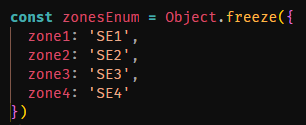

# Testspecifikation
## **BESKRIVNING**
Modulen har testats genom manuella tester vilket redovisas i den här rapporten. Inga krav finns kopplade till testen. Samtliga tester som genomförts avser modulversion 1.0.0. Vid eventuella frågor kring installationen eller hur modulen fungerar så hänvisas läsaren till i README.md. Varje metod har testats manuellt och metoderna har körts via testModule.js och utfallet har dokumenterats nedan.  
## **FÖRKRAV**
En förutsättning för att nedanstående testfall ska kunnat genomförats korrekt och ge ett korrekt utfall är att samtliga privata metoder som återfinns i spotPriceApi.js är korrekta. Därav finns inga egna testfall över de metoder utan deras status ingår i TF 1.

## **ÖVERSIKT**

### **Klass ElectricityRatesProvider - index.js**
| Metod | Status | Testfall |
| ----------- | ----------- | ----------- |
| getHourlyPricesAllBiddingZones() | ✅ | TF 1 |
| getHourlyPricesForOneBiddingZone() | ✅ | TF 2 |
| #extractStartTimeFromDate() | ✅ | TF 2 |
| sortHoursPerHighestPrice() | ✅ | TF 3 |
| sortHoursPerLowestPrice() | ✅ | TF 4 |
| calculatePropaneKilowattPrice() | ✅ | TF 5 |
| getHoursWhenPropaneIsCheaper() | ✅ | TF 5 |
| #dividePropanePriceWithKilogram() | ✅ | TF 5 |
| #convertCrownsToPennies() | ✅ | TF 5 |
| calculateWattToKilowatt() | ✅ | TF 6 |
| calculateKilowattToMegawatt() | ✅ | TF 7 |
| calculateConsumedWattToWattHours() | ✅ | TF 8 |
| calculateCostPerDayForProduct() | ✅ | TF 9 |
| #roundDecimalsInNumber() | ✅ | TF 10 |

---

### **Klass SpotPriceApi - spotPriceApi.js**
| Metod | Status | Testfall |
| ----------- | ----------- | ----------- |
| getTomorrowsElectricityData() | ✅ | TF 1 |
| #getTomorrowsDate() | ✅ | TF 1 |
| #convertToCorrectDateFormat() | ✅ | TF 1 |
| #getDayAheadData() | ✅ | TF 1 |
| #extractElectricityPricesAndZones() | ✅ | TF 1 |
| #convertStringToNumber() | ✅ | TF 1
| #divideNumberWithTen() | ✅ | TF 1

---

### **Klass ValidateInputHandler - validateInputHander.js**
| Metod | Status | Testfall |
| ----------- | ----------- | ----------- |
| validateIfValidZone() | ✅ | TF 11 |
| validateIfNumber() | ✅ | TF 12 |

 

# Testfall
Öppna upp ett test för att ta del av utfallet

<b>TF 1. Hämta timpriser för alla zoner</b>

 
<b>TESTADE SCENARION, TOTAL 2 ST.</b>
 

1) Morgondagens timpriser för alla zoner kan hämtas efter kl 13 dagen innan. Del av utfall:  

 
2) Hämtas morgondagens timpriser innan kl 13 dagen innan så sätts priset till 0. Del av utfall: 

---

<b>TF 2. Hämta timpriser för en specifik zon</b>

 
<b>TESTADE SCENARION, TOTAL 2 ST.</b>
 
1) Morgondagens timpriser för en specifik zon kan hämtas efter kl 13 dagen innan. Klockslaget ska även vara extraherat ur datumet och presenteras för användaren.  

 
2. Hämtas morgondagens timpriser innan kl 13 dagen innan så sätts priset till 0. Bilden visar ett utdrag av utfallet. 

---

<b>TF 3. Sortera timpriset från högt till lågt</b>

 
<b>TESTADE SCENARION, TOTAL 1 ST.</b>
 
1) Efter att morgondagens timpriser har hämtats så kan en specifik zon sorteras från högsta pris till lägsta. Utfall: 

---

<b>TF 4. Sortera timpriset från lågt till högt</b>

 
<b>TESTADE SCENARION, TOTAL 1 ST.</b>
 
1) Efter att morgondagens timpriser har hämtats så kan en specifik zon sorteras från lägsta pris till högsta. Utfall: 

---

<b>TF 5. Räkna ut vilka timmar det är mer fördelaktigt att använda gasol</b>

 
<b>TESTADE SCENARION, TOTAL 2 ST.</b>
 
1) Först räknas gasolens kilowattpris fram. Detta fås fram genom att ta gasolpriset delat på x-antal kg gasol vilket då ger ett kilopris. 
Ett kg gasol genererar 12.8 kwh och genom att ta det framräknade kilopriset delat på 12.8 så får vi fram priset per kilowatt. Priset omvandlas sedan till svenska ören. I testet sätts gasolpriset till 225:- och vikten till 11 kg. Detta ger ett kilowattpris, i ören, på 159.8.   

Kilopriset uträknat 
 
Omvandlar kronor till ören. 
 
Beräknat kilowatt pris 

2) Vidare används ovanstående kilowattpris till att jämföra under vilka timmar i en specifik zon det är mest fördelaktigt att använda gasol jämfört mot elektricitet. De timmar då elpriset per kilowatt är högre än gasolens pris per kilwatt filtreras ut och presenteras.

---

<b>TF 6. Konvertera watt till kilowatt</b>

 
<b>TESTADE SCENARION, TOTAL 1 ST.</b>
 
1) För att konvertera watt till kilowatt så används formeln P(kW) = P(W) / 1000. Således så ska värdet 100 som skickas in till metoden resultera i värdet 0.1. 
Utfall:

<b>TF 7. Konvertera kilowatt till megawatt</b>

 
<b>TESTADE SCENARION, TOTAL 1 ST.</b>
 
1) För att konvertera kilowatt till megawatt så används formeln P(MW) = P(kW) / 1000. Således så ska värdet 5 som skickas in till metoden resultera i värdet 0.005. 
Utfall:

<b>TF 8. Konvertera watt till wattimmar</b>

 
<b>TESTADE SCENARION, TOTAL 1 ST.</b>
 
1) För att konvertera watt till wattimmar så används formeln W X h = Wh. Således så ska värdet (100, 24) som skickas in resultera i värdet 2400. Utfall:

<b>TF 9. Kalkylera kostnad per dag för en produkt</b>

 
<b>TESTADE SCENARION, TOTAL 1 ST.</b>
 
1) För att räkna ut hur mycket en apparat kostar per dag så används formeln (kwh * timmar * pris). Således så ska värdet (100, 24, 125.00) som skickas in resultera i värdet 300, värdet avser ören. Utfall:

 

<b>TF 10. Avrunda decimaler i ett värde</b>

 
<b>TESTADE SCENARION, TOTAL 1 ST.</b>
 
1) Ett värde som innehåller decimaler ska returneras med maximalt två decimaler.
 Utfall:

<b>TF 11. Validera vald zon</b>

 
<b>TESTADE SCENARION, TOTAL 2 ST.</b> 
Valideringen sker mot ett enum/objekt som består av Sveriges fyra elområden. 

 
1) Kontroll görs att korrekt zon, oavsett om den matas in med gemener eller versaler, hanteras som true.
 Utfall:

 
2) Kontroll görs att en felaktig zon kastar ett fel.
 Utfall:

 

<b>TF 12. Validera datatyp Number </b>

 
<b>TESTADE SCENARION, TOTAL 2 ST.</b> 

1) Kontroll görs att en array som enbart består av datatyp Number returneras som true. 
 Utfall:

 
 
2) Kontroll görs att en array som inte innehåller enbart datatyp Number kastar ett fel
 Utfall:

 
 

 

---